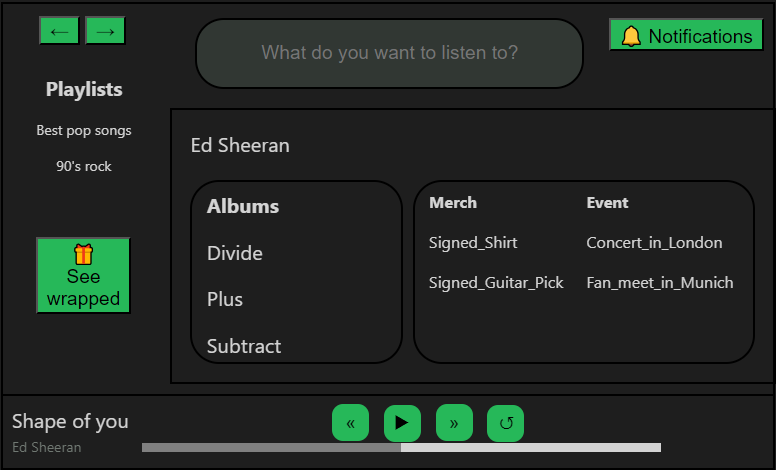

*COPYRIGHT RUSU BOGDAN*
# Project GlobalWaves  - Stage 1

The purpose of the `first stage` of the project is to implement a `backend` simulation of a `Spotify-like` application in `Java` that supports `user input`.
* the goals of the project include:
  * utilizing basic OOP concepts to conceive a `larger-scale` Java project;
  * usage of `inheritance` and `overriding/overloading` to achieve reusable code;
  * debugging in a different `programming language`.

* user input comes in the form of a `JSON` file that is parsed using the `ObjectMapper` class and its functionalities.
* after determining the `type` of the command, a `copy constructor` is called to perform said command and formats the output back into a `JSON file`.

* the `conceptual approach` for the task was as follows in the picture bellow:

* each user has a `UserInterface` object predefined to them and each `UI` has a `SearchBar`, a `Player` and a `Playlist` ArrayList as its main objects.
* the most `interesting` part, though, is how the the `state` of the loaded `Audio File` is kept:
  * whenever the user loads a new Audio File, a new `state` object is created, which is `updated` each time the user inputs a new command;
  * for the `Podcast` audio file, a `Resumer` object is also kept, implemented with a `HashMap`, so as to keep track of the `progress` within a `Podcast`, whenever the user loads it a second time.
* a `Like` and a `Playlist` database are kept as `Global Objects` so as to facilitate fast access to `statistics` or `search`.
* the `Next`, `Prev`, `Backward` and `Forward` commands employ the change of state of the current loaded source
  * e.g. for `Next`, there is a change of state of the audio file as though its `remaining time duration` has suddenly been reduced to 0'
  * for `Backward`, there is a change of state of the audio file as though its `remaining time duration` has been increased by 90 seconds

  # Project GlobalWaves  - Stage 2
  The `second part` of the project supports the addition of entities such as: `privileged users` (artists and hosts), audio files belonging to them (`albums` and `podcasts` respectively) and certain types of `items` (events, annoucements or merch) that are all `stored` inside a `database` (`Global Objects`) implemented using the `Singleton` design pattern.
  
  Simultaneously, this stage also presents a `page system`, that follows the principles of `Spotify` and is envisioned in the `HTML/CSS` visual preview of the app itself.
    * the `page system` is implemented with the help of the `Visitor Design pattern` where the visitors itselves are the `builder` and the `printer` ones
    * whenever a normal user searches for an `artist` or `host` and selects a result item, their `current page` is changed to that of the `special` user selected
    * for the `artists` and `hosts` their pages store their `posted information` and `audio collections` and are `statically built`, meaning whenever there appear `changes` to their pages, all users receive the changes as the `current page` of the normal users stores the `instance of the page` of the special user
    * the `Home and LikedContent pages` of the normal users are built `dinamically`, meaning at each `print page command` issued by them, the `database` is queried and the `sorted information` is displayed

  The `newly added` Album entity respects the same rules as the `Playlist` entities and the way the commands on them behave are `generally the same` as fo the playlists.

  This stage of the application `also supports` the status of the `normal users`, meaning their connection can be `interrupted` and their actions be ceased. `Technically`, the `offline status` is a `pause command`, but it implies displaying `error messages`, whenever they attempt to issue a new command. Because of that, the way this command is treated is whenever the `connection` is set to be `offline` (a field in the `user interface` of every user is set on `false`, initially all users are `online`, the variable `connectionStat` being set on `true`), the currently `loaded` audio file/collection keeps its state before the `loss of connection`.

    # Project GlobalWaves  - Stage 3
    The `third part` of the project supports the following `features`:
    * Spotify-like `wrapped` information for `users`, `artists` and `hosts`
      * the implementation of these `statistics` is realized by the `usage` of `hashMaps` and `linkedHashMaps` along with `streams` used for sorting the information relative to `a field of interest`;
      * every time a `normal user` has a `source` loaded into their `player` it triggers the incrementation of the value of the corresponding `hashMap` entry in the `artistTop` attribute member of the `Artist class` or in the `hostTop` attribute member of the `Host class`, respectively;
      * for instance,  when the `user` has a new loaded source into their player, `the application` increases the count the `song`, `album` and `artist` to whom it belongs and the fact that the `user` has an increased number of listens to the artist.
    * `monetization` is split into `2` ways of handling `income`:
      * whenever the `normal user` has `premium status`, we hold a `hashMap`used for storing which songs and how many times the `user` listened to them in the timeframe of their `premium subscription`
        * if the `user` cancels their `subscription` or when the `program ends`, the `subscription money, 1M` is split among the songs stored in the `hashMap` as keys according to how many times the `user` listened to said `songs` (hashMap value) and the `hashMap` is reset
      * whenever the `normal user` has a `free account`, ads can be inserted during his `normal playing` of the audio files and we `simulate` this interaction by having the currently playing `audio file` have its duration increased by the `ad length` and a flag being `set`
        * when the `flag` is set and the player either `moves` to the next `source` or has its `duration` reduced `below 10`, we monetize all the songs the user has listened to `in between` 2 ads or between the first add and `the beginning` of the program, using a technique similar to the one presented for `premium monetization`
  * `notifcations` are implemented as a system of transmiting `news` between the `Subjects` (artists, hosts, playlists) and the `Observers` (normal users):
    * the `notification system` is implemented using the `Observer design pattern`;
    * whenever a `normal user` (implementation of the `Observer` interface) subscribes/unsubscribes from an `artist/host` (implementation of the `Subject interface`) or follows/unfollows a `playlist` (also implementing the `Subject interface`) the `user` is `attached/detached` from the subjects `Observers list`;
    * for example, when a `new album` is added by an `artist`, all the `Observers` from the list are `notified` by this `addition` and introduce this notification inside an internal `ArrayList` that holds all the notifications
    * when the `user` decides to access their notifications, they are `output` to the json file accordingly, and are erased from the `internal list`

  * `page navigation` is built in order to facilitate `traveling` between recent `pages` faster and is implemented using the `Memento design pattern`:
    * the `memento` is represented by a page state that can be `saved` or `restored` by the `originator` (user interface)
    * whenever the user `changes` the current page, the `Caretaker` (NavigationHistory) is employed to `save` the state `produced` by the `originator` into an `internal backwards stack` and the `forwards stack` of the `Caretaker` is cleared;
    * if the `user` wants to restore a `previous state`, the `memento` of that state is pulled from the `caretaker` backwards stack and restored to the `user interface` and the state before the `prevPage` command is `pushed` to the `forwards stack`
    * if the `user` wants to restore a `previous forward state`, the `memento` of that state is pulled from the `caretaker` forwards stack and restored to the `user interface` and the state before the `nextPage` command is `pushed` to the `backwards stack`
  * the `recommendations feature` is based on the use of `hashMaps` and `streams` for `sorting` and `limiting` the number of options available for the `newly` created entities